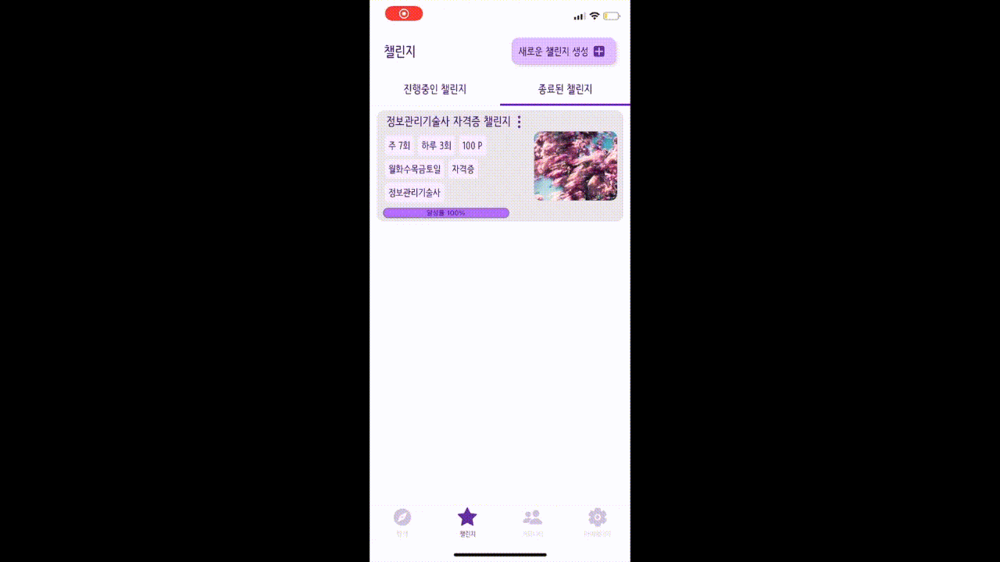
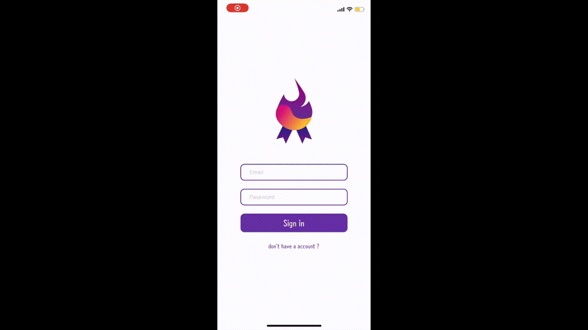

 창의융합종합설계2 프로젝트 

  
  <h3 align="center">자격증 챌린지 어플</h3>
  

    자격증 공부, 혼자 하지말고 같이하세요!
     
    <a href="https://github.com/rlawldud335">김지영</a>
    ·
    <a href="https://github.com/hyejung-Kim">김혜정</a>
    ·
    <a href="https://github.com/dalbikim">김달비</a>
    ·
    <a href="https://github.com/jihy2on">김지현</a>
  

 
 

# 프로젝트 소개
## 핵심기능
  

[주제제안서 발표자료 보기](https://drive.google.com/file/d/11gzE6Un4ljD0lYDAkLmX89Qd7-8FGXWL/view?usp=sharing)  
1. 사람들과 공부인증 기능으로 매일 의지를 다지기!
2. 인증률에 따른 포인트 환급 기능!
3. 커뮤니티에서 자유로운 소통과 정리노트를 판매
4. 자격증 접수, 시험 일정을 알림

## 개발 스택

#### Front-end
- React Naitve
- Expo
  
#### Back-end
- Node.js
- Express.js
- MySQL

#### Infra
- AWS S3
- AWS EC2
  

## 실행 방법
#### Front-end
~~~
npm start
~~~
#### Back-end
~~~
npm start
~~~
#### Intra
~~~
Test
~~~

## 데모
### 챌린지 생성

### 챌린지 참가

### 챌린지 결과

### 커뮤니티

### 마이페이지

## UI
### 1. Search Tab
#### 메인 화면

    
    

#### 알림 & 일정

    
    
    

#### 검색

    
    

#### 카테고리별 챌린지 조회
- 카테고리 : '자격증', '스터디', '전체'

    
    

#### 챌린지 상세보기

    
    

### 2. My Challenge Tab
#### 진행중인, 종료된 챌린지

    
    

#### 진행중인 챌린지 상세보기

    
    
    
    

#### 사진 인증

    
    

#### 새로운 챌린지 생성

    
    
    
    
    
    

### 3. Community Tab
#### 자유게시판

    
    
    

#### 판매게시판

    
    
    

### 4. MyPage Tab
#### 회원정보관리

    
    

#### 포인트 관리

    
    
    
    

#### 커뮤니티 관리

    
    
    

# 프로젝트 결과
### 수상
- KIT Engeenering Fair 동상

  